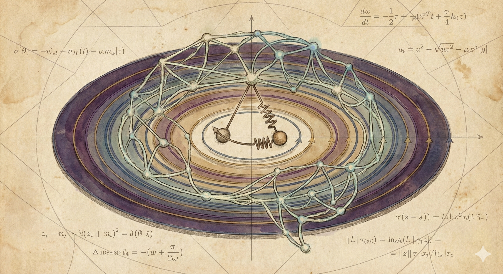
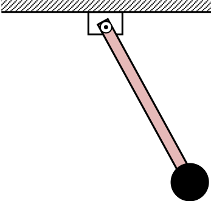
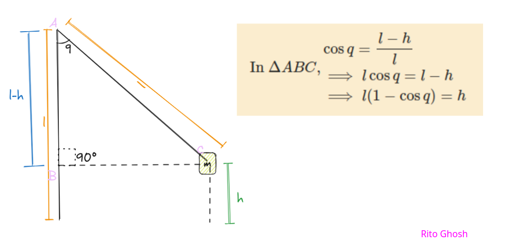
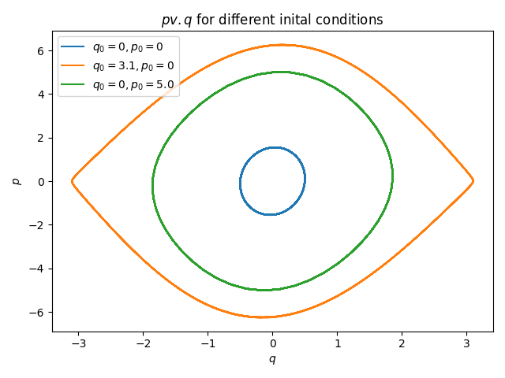
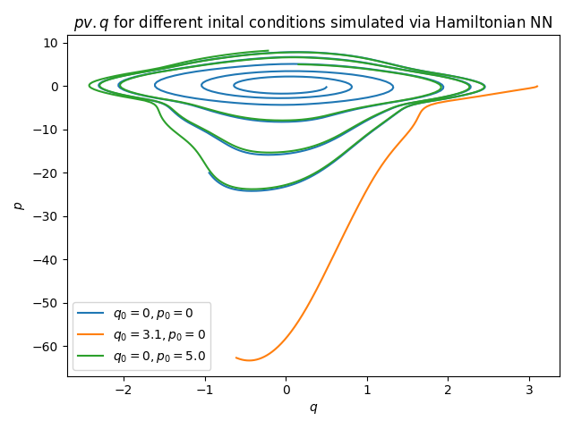

## Training a Hamiltonian Neural Network: Using an NN for Simulating the Phase Space of a Harmonic Oscillator



## Introduction

We can use Neural Networks not only for predicting the class of an image, completing sentences, or classifying sentiment of a paragraph of text. We can also use Neural Networks for solving scientific problems. In this article, you will learn about using a trained Neural Network to simulate the phase space of a Harmonic Oscillator (a weighted rigid pendulum). Here, there's a twist. We will train the Neural Network not by calculating the loss between the outputs and the ground truth data, but we will *train using the derivatives*. We will leverage our Physics knowledge to train the Neural Network.

## Prerequisites

I expect the reader to be knowledgeable about basics of training a Neural Network from scratch- using a library like PyTorch, Jax, etc. I will use PyTorch in this project. I expect no knowledge of Hamiltonian Dynamics or college-level Physics, but knowing the basics of Physics up to High School level. Being well-versed in Differential Calculus is required. Experience with Python is helpful. I also expect the reader to have read an earlier post on simulating a spring with Hamiltonian Mechanics and plotting the phase space as well as the trajectory: [Modelling a Spring System in Hamiltonian Mechanics: Using Euler's Method for Trajectory Plotting](../../posts/implicit_euler/index.html).

## Objectives

We will model our system using Hamiltonian Dynamics. And using the Python function, we will plot the phase space of the system. And then using the the derivatives, we will train a Neural Network using those derivatives. Then we will use the trained Neural Network to again simulate the system and plot the phase space of the system. And we will see how the NN is doing. If you don't know about Hamiltonian Dynamics or phase spaces, then that's okay. I will cover what we need.

## Code

All code used in this project is available on GitHub: [**ritog/harmonic**](https://github.com/ritog/harmonic).

## Our Physical System

We will work with a rigid pendulum.



The related variables are:

- A body of mass $m$ on a rigid rod of length $l$
- Angle $q$ ($0$ is straight down)
- Angular momentum, $p$
- Gravity $g$

## Defining the Hamiltonian of Our System

1.  Potential Energy($V$): Height is $l(1-\cos{q})$, so, $V = mgl(1-\cos{q})$

How? 

2.  Kinetic Energy ($T$):

Rotational kinetic energy is $\dfrac12 I {\omega}^2$. For a point mass, moment of inertia, $I=ml^2$, and angular velocity, $\omega = \dfrac{p}{ml^2}$.

So, Kinetic Energy in terms of momentum, 
$$
T(p) = \dfrac{p^2}{2ml^2}
$$

Remember that, in Hamiltonian mechanics, the Hamiltonian of the system is:

$$
H(q, p) = V + T
$$

And the Hamiltonian equations are:

1.  $\dfrac{dq}{dt} = \dfrac{\partial H}{\partial p}$
2.  $\dfrac{dp}{dt} = -\dfrac{\partial H}{\partial q}$

If we calculate theses, we will get:

$$
\begin{aligned} \frac{dq}{dt} &= \frac{p}{ml^2} & \text{(Angular Velocity)} \\ \frac{dp}{dt} &= -mgl \sin q & \text{(Torque due to Gravity)} \end{aligned}
$$

You can trust me, or check using a pen and paper. Remember that I said the same thing in the last article as well?

## Implementing

This is how we implement this in Python. Using this function, we can find the derivatives, and using these, we can find the trajectory.

Here's a basic implementation using NumPy:

```python
def pendulum_dynamics(t, state: List, m, l, g) -> List:
    """
    inputs:
    t: The current time, solvers expect it.
    state: A list or array containing [q, p].
    m: mass
    l: the length of the rigid pendulum
    g: gravitational acceleration
    output:
    the list [dq_dt, dp_dt]
    """
    dq_dt = state[1] / (m * np.power(l, 2))
    dp_dt = -m * g * l * np.sin(state[0])
    return [dq_dt, dp_dt]
```

Or, we can write a version using `torch`. This will make things better.

```python
def pendulum_dynamics_tensor(t, state: torch.Tensor, m, l, g) -> torch.Tensor:
    dq_dt = (state[:, 1] / (m * torch.pow(torch.tensor(l), 2))).unsqueeze(1)
    dp_dt = (-m * g * l * torch.sin(state[:, 0])).unsqueeze(1)
    return torch.cat([dq_dt, dp_dt], dim=1)
```

We can use the earlier function to plot the trajectory of the pendulum.

```python
from pendulum_nonlinear import pendulum_dynamics

# different initial states
init_a = [0.5, 0]  # small release
init_b = [3.1, 0]  # close to top
init_c = [0, 5.0]  # close to bottom with force

# params
m = 1.0    # mass
l = 1.0    # length of rod
dt = 0.05  # time-step
g = 9.8    # gravitational acceleration

def run_simulation(init_state: List):
    p_vals = []
    q_vals = []
    for i in range(1_000):
        q, p = init_state
        _, dp_dt = pendulum_dynamics(t=dt, state=[q, p], m=m, l=l, g=g)
        p = p + dp_dt * dt
        dq_dt, _ = pendulum_dynamics(t=dt, state=[q, p], m=m, l=l, g=g)
        q = q + dq_dt * dt
        init_state = [q, p]
        q_vals.append(q)
        p_vals.append(p)
    return p_vals, q_vals

a_p_vals, a_q_vals = run_simulation(init_a)
b_p_vals, b_q_vals = run_simulation(init_b)
c_p_vals, c_q_vals = run_simulation(init_c)

# Plotting
plt.plot(a_q_vals, a_p_vals, label="$q_0=0, p_0=0$")
plt.plot(b_q_vals, b_p_vals, label="$q_0=3.1, p_0=0$")
plt.plot(c_q_vals, c_p_vals, label="$q_0=0, p_0=5.0$")
plt.xlabel("$q$")
plt.ylabel("$p$")
plt.title("$p v. q$ for different inital conditions")
plt.legend()
plt.tight_layout()
plt.show()
```

This is the plot that the code generates:



The Blue and green loops represent the pendulum swinging back and forth. It doesn't have enough energy to go over the top, so it stays trapped in a closed loop. The Orange loop is right on the edge! If you had just a tiny bit more energy, the pendulum would stop swinging back and start spinning 360° continuously.

One of the reasons that Hamiltonian Neural Networks are better than vanilla Neural ODEs comes from Hamiltonian Mechanics. There's a special property called Liouville's Theorem, which says that the total area under the curve for the total set of initial points will be preserved for the total set of end points. That is, if you think of the initial points as a blob of points, then the blob might stretch, skew, twist, or distort, but the total area will remain constant. This is how Neural Networks handle data in higher dimension, and maps training data to target. I recommend that you watch Alfredo Canziani's video from NYU CDS: [02 -- Neural nets: rotation and squashing](https://youtu.be/0TdAmZUMj2k?si=dcQG-2jwaYiVwyHx&t=1127) to get great a visual grasp of this. These kind of transformations are modelled and studied extensively in Linear Algebra.

This incompressible flow of points, and fluid-like behaviour (as opposed to gas-like, as gases compress and expand) are great for Neural Networks, and NNs trained using Hamiltonian mechanics are much more robust and well-behaved than simple NODEs.

I am not writing more about this here. Maybe in a future post I write more on this.

## Hamiltonian Neural Network

With our Python function, we can generate the data from our knowledge of Physics.

With Deep Learning, we solve the opposite problem- going from data to the Physics.

Standard Neural ODEs try to learn the derivatives directly from the available data.

Input: $(q, p)$, Output: $(\dfrac{dq}{dt}, \dfrac{dp}{dt})$

But, Hamiltonian Neural Networks are smarter. Instead of training the NN to predict the data, we force the NN to *predict the Hamiltonian* of the system.

$$
\hat{H} = NeuralNet(q, p;\theta)
$$

Here, $\theta$ is the set of trainable parameters of the neural network.

We ask the Neural Network to output the Hamiltonian of the system. And, *as the Neural Network is just a chain of differentiable math operations, if we calculate the gradients of the output (\$), with respect to the variables $q$ and $p$, then, what we have are predicted time derivatives of the Hamiltonian*.

1.  $\dfrac{d\hat{q}}{dt} = \dfrac{\partial \hat{H}}{\partial p}$
2.  $\dfrac{d\hat{p}}{dt} = -\dfrac{\partial \hat{H}}{\partial q}$

Here is our Neural Network:

```python
import torch
from torch import nn

device = "cuda" if torch.cuda.is_available() else "cpu"

class HNN(nn.Module):
    def __init__(self):
        super().__init__()
        self.linear_block = nn.Sequential(
            nn.Linear(2, 200),
            nn.Tanh(),
            nn.Linear(200, 200),
            nn.Tanh(),
            nn.Linear(200, 1),
        )

    def forward(self, x):
        H = self.linear_block(x)
        return H
```

There are two things to note in the code:

- There is no activation function at the end of the final Fully Connected (FC) layer. Because we want the Neural Network to output a value that is perceived as the total energy of the system, and it's a real-numbered value, not limited to the range of the $\tanh{}$ function.
- We chose the `tanh()` activation function. As the function is thoroughly differentiable at every point.

We want to feed a batch of 200 pairs of $q$ and $p$ to the NN.

## Training the Hamiltonian Neural Network

We want to write vectorized code. We don't want to bottleneck the model by feeding in data through naive for loops.

For that, we can write a function to get the derivatives of the model, in batches:

```python
import torch
from HNN import HNN

device = "cuda" if torch.cuda.is_available() else "cpu"

def get_model_time_derivatives(model, x):
    """
    Compute time derivatives [dq/dt, dp/dt] for a batch of inputs.
    x: Tensor of shape (Batch_Size, 2)
    """
    H_hat = model(x)

    # sum the energy to get a scalar,
    # the gradients separate out perfectly per row
    grads = torch.autograd.grad(H_hat.sum(), x, create_graph=True)[0]

    # grads shape: (Batch, 2) -> [dH/dq, dH/dp]

    # flipping (Symplectic Swap (Hamilton's Eqs))
    # dq/dt =  dH/dp
    # dp/dt = -dH/dq

    dH_dq = grads[:, 0].unsqueeze(1)
    dH_dp = grads[:, 1].unsqueeze(1)

    return torch.cat([dH_dp, -dH_dq], dim=1)  # - because minus
```

There is a nice trick with the summing up of the predicted Hamiltonians. PyTorch can only find gradients of scalars. And here we have a tensor of predicted Hamiltonians. We can just sum them up, and then find the gradient with respect to the whole batch of the inputs. And everything gets neatly stored in rows. Gradient of a sum is equal to sum of gradients.

I am not going deep into it for now. I hope that you know why this is the case.

Here's what the training script looks like:

```python
import torch
from tqdm import tqdm

from HNN import HNN
from hnn_model_derivs import get_model_time_derivatives
from pendulum_tensor import pendulum_dynamics_tensor

device = "cuda" if torch.cuda.is_available() else "cpu"

# params
m = 1.0    # mass
l = 1.0    # length of rod
dt = 0.05  # time-step
g = 9.8    # gravitational acceleration

mean = torch.tensor([-3.0, 3.0])
std = 0.1
init_states = (6 * torch.rand(1_000, 2) - 3).to(device).requires_grad_()

true_derivatives = pendulum_dynamics_tensor(t=dt, state=init_states, m=m, l=l, g=g)

hamiltonian_nn = HNN().to(device)
loss_func = torch.nn.MSELoss()
optimizer = torch.optim.Adam(hamiltonian_nn.parameters(), lr=1e-2)

n_epochs = 1_200

for epoch in tqdm(range(n_epochs + 1)):
    deriv_pred = get_model_time_derivatives(hamiltonian_nn, init_states)
    loss = loss_func(deriv_pred, true_derivatives)

    optimizer.zero_grad()
    loss.backward(retain_graph=True)

    optimizer.step()
    if epoch % 100 == 0:
        print(f"Epoch: {epoch}\t Loss: {loss}")

torch.save(hamiltonian_nn.state_dict(), "hamiltonian_nn_1.pth")
```

Note the calculation of loss- `loss = loss_func(deriv_pred, true_derivatives)`. We calculate the loss between predicted and true derivatives. You are usually accustomed to see the loss being calculated between `y_pred` and `y`. But the parameters of the model get updated through backpropagation, as the optimizer receives them: `optimizer = torch.optim.Adam(hamiltonian_nn.parameters(), lr=1e-2)`.

After running this script, I had a loss of $0.0009111023391596973$ - which is great.

Note that I *train the model derivatives to be close to the true derivatives* - unlike normal NNs - where we train the model to output values close to the ground truth.

Throughout the training, and generating data, maintaining the graph of the computation is crucial.

## Plotting the Trajectory as Predicted Using the Model

Now, I will plot the trajectory as solved from the derivatives predicted by the Neural Network. Here, we are using Semi-Implicit Euler's Method to find points in the phase space. To learn more about this, read the previously mentioned post.

```python
# Here, we have an already trained HNN
# We use it to plot trajectory
import torch
from matplotlib import pyplot as plt

from HNN import HNN
from hnn_model_derivs import get_model_time_derivatives

device = "cuda" if torch.cuda.is_available() else "cpu"

# different initial states
init_a = torch.tensor([0.5, 0]).to(device)  # small release
init_b = torch.tensor([3.1, 0]).to(device)  # close to top
init_c = torch.tensor([0, 5.0]).to(device)  # kicked from near bottom

# params
m = 1.0  # mass
l = 1.0  # length of rod
dt = 0.05  # time-step
g = 9.8  # gravitational acceleration

hamiltonian_model = HNN().to(device)
hamiltonian_model.load_state_dict(torch.load("hamiltonian_nn_1.pth", weights_only=True))

def run_simulation_HNN(init_state: torch.Tensor):
    p_vals = []
    q_vals = []
    for i in range(1_000):
        curr_state_tensor = (
            init_state.clone().detach().unsqueeze(0).requires_grad_(True)
        )
        derivs = get_model_time_derivatives(hamiltonian_model, curr_state_tensor)

        dq_dt = derivs[0, 0]
        dp_dt = derivs[0, 1]

        q_old, p_old = init_state

        p_new = p_old + dp_dt * dt
        q_new = q_old + dq_dt * dt

        init_state = torch.tensor([q_new, p_new]).to(device)

        q_vals.append(q_new.item())
        p_vals.append(p_new.item())
    return p_vals, q_vals

a_p_vals, a_q_vals = run_simulation_HNN(init_a)
b_p_vals, b_q_vals = run_simulation_HNN(init_b)
c_p_vals, c_q_vals = run_simulation_HNN(init_c)

# Plotting
plt.plot(a_q_vals, a_p_vals, label="$q_0=0, p_0=0$")
plt.plot(b_q_vals, b_p_vals, label="$q_0=3.1, p_0=0$")
plt.plot(c_q_vals, c_p_vals, label="$q_0=0, p_0=5.0$")

plt.xlabel("$q$")
plt.ylabel("$p$")
plt.title("$p  v. q$ for different inital conditions simulated via Hamiltonian NN")
plt.legend()
plt.tight_layout()
plt.savefig("FIG5.png")
```

Note that, we are not using a Python function for this plot, but load the trained weights from a `.pth` file: `hamiltonian_model.load_state_dict(torch.load("hamiltonian_nn_1.pth", weights_only=True))`.

This is the plot that we get:



For the inner loops (blue and green), The network did a decent job learning the "swinging" motion! It captured the concentric nature of the phase space near the center. The outer "loop" (orange): This trajectory starts at q=3.1. In our clean phase space figure, this was a closed loop (the "eye"). In our HNN simulation, it drifts off significantly.

This is due to the fact that the point was an out-of-distribution data point for the model.

## Conclusion

We have trained a Neural Network's parameters so that the model learns the Physics from the data, by making *its gradients* be close to the real derivatives. We saw that we can leverage our Physics knowledge in training of Neural Networks, and leverage Physical properties like Liouville's Theorem to train well-behaved NNs with predictable behaviour.

------------------------------------------------------------------------

### Discuss

If you have read this post, and found it interesting or edifying, please let me know. I would like that very much. If you have any criticism, suggestion, or want to tell me anything, just add a comment or let me know privately. Discuss this post on the [Fediverse](https://mathstodon.xyz/@rg/115844261208692910), [Hacker News](https://news.ycombinator.com/item?id=46508707), or [Twitter/X](https://x.com/AllesistKode/status/2008268111871713479).

### Changelog

This is an Open Source blog. Feel free to inspect diffs in the GitHub [repo](https://github.com/ritog/ritog.github.io).

{width="256"}

------------------------------------------------------------------------

### Cite this Article

    @ONLINE {,
        author = "Ritobrata Ghosh",
        title  = "Training a Hamiltonian Neural Network",
        month  = "jan",
        year   = "2026",
        url    = "https://ritog.github.io/posts/hamiltonian_nn"
    }
