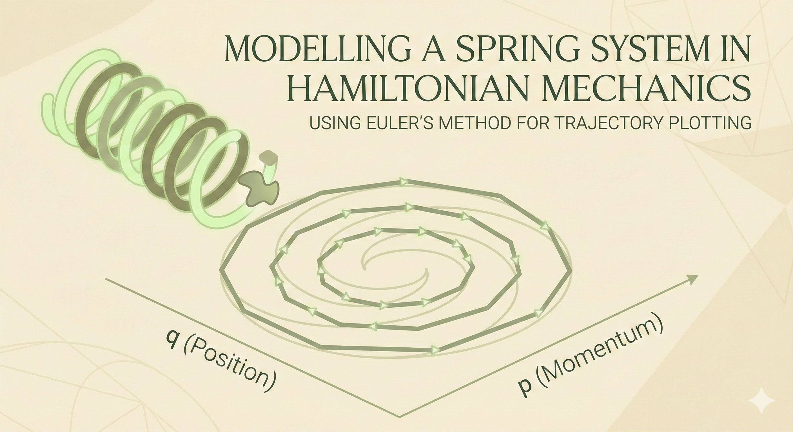
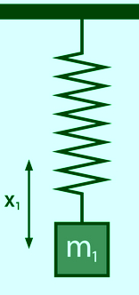
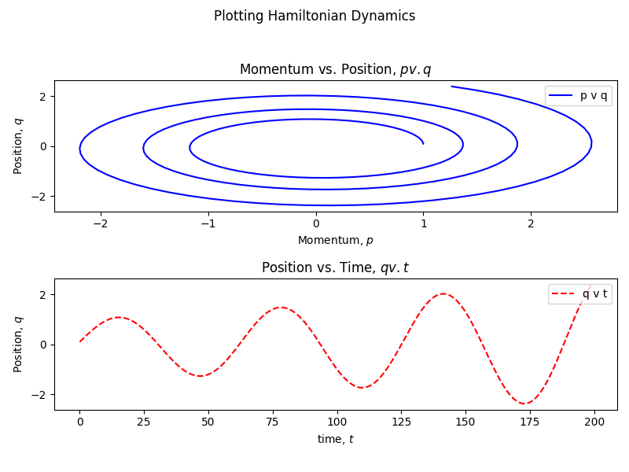
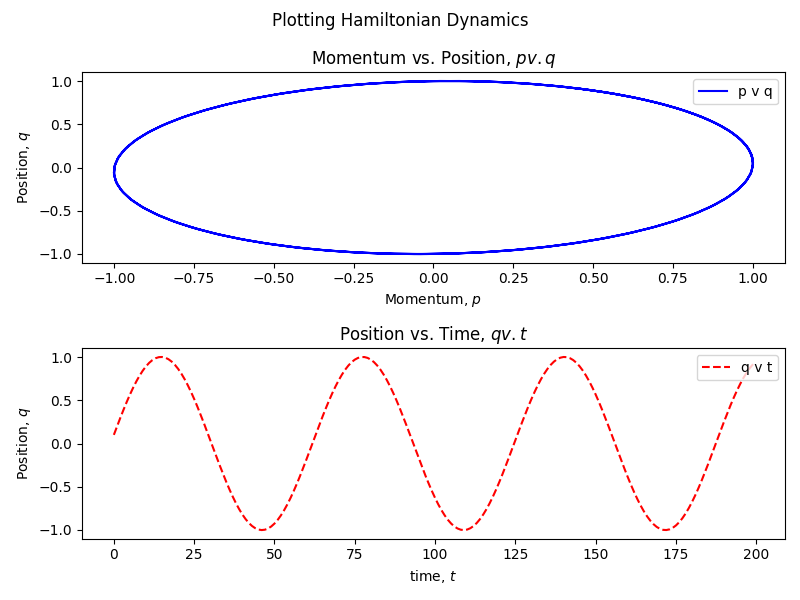

## Modelling a Spring System in Hamiltonian Mechanics: Using Euler Method for Trajectory



## Introduction

Hamiltonian Mechanics provides us with ways to deal with dynamical systems computationally. We can simulate a system of a weighted spring using Hamiltonian mechanics. We can plot trajectories using the simulation. We will use Euler's method and Semi-Implicit Euler's method to plot phase spaces, and compare between them. In a future post, I will describe the training of a Hamiltonian Neural Network for learning the physics of a non-linear system, and simulate it.

## Code

All code used in this project, as well as code that can be used to reproduce the project can be found on GitHub: [ritog/spring_hamiltonian](https://github.com/ritog/spring_hamiltonian).

## Prerequisites

I expect the reader to have some programming background in any imperative language. I will use Python. I expect no knowledge of Hamiltonian Dynamics or college-level Physics, but knowing the basics of Physics up to High School level is needed. Being well-versed in Differential Calculus is required. Experience with Python is helpful.

## Objectives

We will model our system using Hamiltonian Dynamics. We will first write a function to get derivatives of two variables at each step. And using the Python function, we will plot the phase space of the system. For doing that we will need to integrate them using a DE solver - we will use Euler's method. Then we will see if that suffices. If not, we will switch to implicit Euler, and plot the same phase space. If you don't know about Hamiltonian Dynamics or phase spaces, then that's okay. I will cover what we need. This is a trivial example for something I want to build up to- training a Hamiltonian Neural Network. But that's not the objective of this article.

## Our System

We have a mass $m$ attached to a spring of negligible mass.



And we are concerned with only two variables of the system- the position $q$, and the momentum $p$ ($p = m \cdot v$). These are the only two variables needed to construct the Hamiltonian. And if we plot $p$ versus $q$ in a 2-dimensional figure, what we get is called a **phase space**.

## Hamiltonian of the System

The Hamiltonian of the system is the total energy of the system. It is the sum of kinetic and potential energies of that system. And it is characterized by position and momentum of a particular body.

You are probably more familiar with Newtonian Mechanics where we are more concerned with *force*. Newton's Second Law of Motion, $F = ma$, is a second-order differential equation, $F = m \times \dfrac{d^2x}{dt^2}$, where $x$ denotes the position of the body. Computational solvers work better with first-order differential equation, or a system of first-order DEs. If you would like to read a nice article on DEs and solving them computationally with Julia, read this post: [Solving First Order Differential Equations with Julia](../../posts/1st-order-DE-julia/1st_order_DE_julia.html), [Hacker News discussion](https://news.ycombinator.com/item?id=43245172).

With Hamiltonian system, we get what computers are better at solving. Although that's not why it was invented or used for a long time. With Hamiltonian mechanics, we have conservation laws baked in, and it can represent evolution of the system through time as a flow, and it provides many geometrical niceties which we will not delve (I know) deep into in this article.

The Hamiltonian of our system, is the sum of kinetic and potential energies of the system. And it is always conserved.

Hamiltonian, $H$ of our system:

$$
H(q, p) = \text{Kinetic Energy + Potential Energy}
$$

The Hamiltonian is a function of $p$ and $q$ only.

$$
H(q, p) = \dfrac12 mv^2 + \dfrac12 kx^2
$$

The above equation can be re-written as:

$$
H(q, p) = \dfrac{p^2}{2m} + \dfrac12 kq^2
$$

As $v = \dfrac{p}{m}$. And the position $x$ is simply rewritten as $q$.

## Hamiltonian Equations

The Hamiltonian Equations are:

1.  $\dfrac{dq}{dt} = \dfrac{\partial H}{\partial p}$
2.  $\dfrac{dp}{dt} = -\dfrac{\partial H}{\partial q}$

If you have never seen partial derivatives before- they are simple if you know derivatives. In partial derivatives, the variable you are differentiating with respect to, is treated as a variable. All other variables, *and constants* are treated as constants.

Let's say there is a function, $f(m, n) = m^2n + n^3m + m - n$ then $\dfrac{\partial f}{\partial m} = 2mn + n^3 + 1$ and $\dfrac{\partial f}{\partial n} = m^2 + 3n^2m - 1$. Even though $m$ and $n$ are variables, when we are differentiating with respect to one of them, we are treating the other as a constant.

Now, if we calculate the Right Hand Sides of 1 and 2 above, we get,

$$
\begin{aligned} \frac{dq}{dt} &= \frac{p}{m} \\ \frac{dp}{dt} &= -kq \end{aligned}
$$

You either trust me, or pick up a pen and paper and work through them!

Now, look at the equations above. This is the core beauty of Hamiltonian mechanics. The change in $q$ through time is dependent on $p$ and the change in $p$ is dependent on $q$.

## Writing a Program

Now we can code up the Python function that will give us $\frac{dq}{dt}$ and $\frac{dp}{dt}$. This is where we will get the true derivatives that will later guide our training, and will also help up simulate the system.

```python
def harmonic_dynamics(t, state: List, m, k) -> List:
    """
    inputs:
    t: The current time, solvers expect it.
    state: A list or array containing [q, p].
    m, k: The mass and spring constant.
    output:
    the list [dq_dt, dp_dt]
    """
    dq_dt = state[1] / m
    dp_dt = -k * state[0]
    return [dq_dt, dp_dt]
```

This is a basic function that returns a Python array. We will not deal with PyTorch arrays or SIMD hardware for now.

This function returns terms analogous to velocities, but to plot the phase space, we will need something analogous to positions. And we need to integrate.

## Euler's Method

We could use something like [`scipy.integrate`](https://docs.scipy.org/doc//scipy-1.16.2/tutorial/integrate.html), but let's implement our own solver in Python. We will implement a solver using the Euler Method.

You can read formally about Euler Method in any decent book covering DEs, but, put simply, it says that- *"The state in the next moment is the current state plus a small step in the direction of the derivative."*

In Math:

$$
\mathbf{y}_{t+dt} = \mathbf{y}_t + \dfrac{d\mathbf{y}}{dt} \cdot dt
$$

## Coding Things Up: The Dynamics of the System

Now, we can get the "positions" in the phase space, using the code below.

```python
from harmonic import harmonic_dynamics

# params
m = 1.0  # mass
k = 1.0  # spring constant
q0 = 0   # initial position
p0 = 1   # initial momentum
dt = 0.1 # time-step

init_state = q0, p0
q_vals = []
p_vals = []

for i in range(0, 200):
    q, p = init_state
    dq_dt, dp_dt = harmonic_dynamics(t=dt, state=[q,p], m=m, k=k)
    q = q + dq_dt * dt
    p = p + dp_dt * dt
    init_state = [q, p]
    q_vals.append(q)
    p_vals.append(p)
```

We are taking the following values for the system:

- mass, $m = 1.0$
- spring constant, $k=1$
- initial position, $q_0 = 0$
- initial momentum, $p_0 = 1$ (started at the center with some momentum)

And for time-stepping, we are taking $dt = 0.1$.

Now if we plot both q vs. p (phase space), and q vs. t, we will get:



## Semi-Implicit Euler's Method

We see that the q vs. p plot is spiralling outward with time. This is not the expected behaviour as the total energy is supposed to be conserved. We also see that this ideal version of the spring is swinging more and more as time goes on. This is not happening due to friction or gravity. They are not even considered here! And nothing is *pumping* energy into the system.

This is happening due to the limits of Euler's Method. Imagine walking on a circular track. Euler's Method says, "take a direction in the direction of the path- the tangent. If you take a straight step along the tangent of a circle, you land slightly outside the circle. Do this 200 times, and you spiral outwards.

To fix this, we need a Symplectic integrator- one that preserves the area in phase space (and thus behaves better with energy). The simplest version is Semi-Implicit Euler.

Instead of updating both q and p based on the old state, we update one, and then use that new value to update the other.

We do this:

- Calculate dp_dt using the current q.
- Immediately update p.
- Then, calculate dq_dt using this new, updated p.
- Update q using that.

Things will be clearer in code. We keep everything else intact. But we change the loop to this:

```python
 for i in range(0, 200):
    q, p = init_state
    _, dp_dt = harmonic_dynamics(t=dt, state=[q, p], m=m, k=k)
    p = p + dp_dt * dt
    dq_dt, _ = harmonic_dynamics(t=dt, state=[q, p], m=m, k=k)
    q = q + dq_dt * dt
    init_state = [q, p]
    q_vals.append(q)
    p_vals.append(p) 
```

Doing this, if we plot again, we get:



Now, it is a well-behaved phase space with no spiralling. And the position vs. time plot is also a smooth sinusoidal wave, as expected.

## Conclusion

We saw that, while simulating a weighted spring in Hamiltonian mechanics, the way we choose to integrate matters a lot.

This was a linear system. In a future post, I will simulate a non-linear system, and train a Hamiltonian Neural Network to simulate the system.

------------------------------------------------------------------------

### Discuss

If you have read this post, and found it interesting or edifying, please let me know. I would like that very much. If you have any criticism, suggestion, or want to tell me anything, just add a comment or let me know privately. Discuss this post on the [Fediverse](https://mathstodon.xyz/@rg/115827298165244834), [Hacker News](https://news.ycombinator.com/item?id=46468733), or [Twitter/X](https://x.com/AllesistKode/status/2007180722139017609).

### Changelog

This is an Open Source blog. Feel free to inspect diffs in the GitHub [repo](https://github.com/ritog/ritog.github.io).

{width="256"}

------------------------------------------------------------------------

### Cite this Article

    @ONLINE {,
        author = "Ritobrata Ghosh",
        title  = "Modelling a Spring System in Hamiltonian Mechanics",
        month  = "jan",
        year   = "2026",
        url    = "https://ritog.github.io/posts/implicit_euler"
    }

### Support

I highly appreciate donations. If you liked this post, or the content in the site in general, support me via [Ko-Fi](https://ko-fi.com/ritog), [Liberapay](https://liberapay.com/ritog) or if you are in India, via UPI [ritogh8@oksbi](https://i.imgur.com/D9rTvVN.png).

<figure class="figure">
<p><a href="https://ko-fi.com/B0B33QVX2"></a></p>
</figure>

[](https://liberapay.com/ritog/donate)
